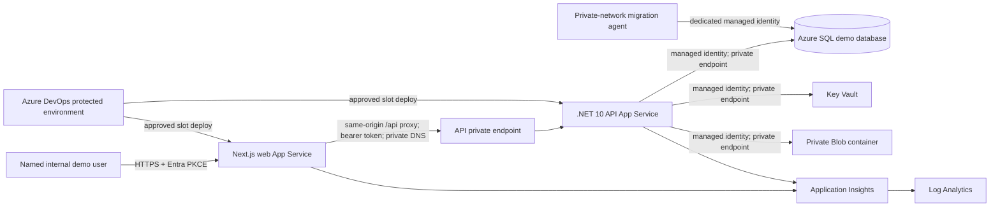

# Restricted Azure Management Demo - Deployment Architecture

```yaml
traceability:
  product_version: "0.1"
  phase: "Phase 1 - MVP"
  capabilities: ["C-01", "C-02", "C-03", "C-04", "C-05", "C-06", "C-07", "C-08", "C-09", "C-10", "C-11"]
  functional_requirements: ["F-01", "F-02", "F-03", "F-04", "F-05", "F-06", "F-07", "F-08", "F-09", "F-10", "F-11", "F-12", "F-13", "F-14", "F-15"]
  non_functional_requirements: ["NF-01", "NF-02", "NF-03", "NF-04", "NF-05", "NF-06", "NF-07", "NF-08", "NF-09", "NF-10", "NF-11", "NF-12", "NF-13"]
  risks: ["R-01", "R-02", "R-04", "R-07", "R-08", "R-09", "R-11", "R-12"]
  assumptions: ["A-01", "A-02", "A-03", "A-04", "A-05", "A-10", "A-11", "A-12", "A-13", "A-14", "A-15", "A-16", "A-18"]
  dependencies: ["D-01", "D-02", "D-03", "D-04", "D-05", "D-06", "D-10", "D-11", "D-13"]
  issues: ["I-01", "I-02", "I-03", "I-04", "I-06", "I-08"]
  open_questions: ["Q-01", "Q-02", "Q-03", "Q-06", "Q-07", "Q-08", "Q-09", "Q-10"]
  approvals:
    - "Product/PRB authority opathre APPROVED exact package commit b8800e1eda014eef1421a1af5427aaea41393496 on 2026-09-29."
    - "Independent TDA PTArchitect APPROVED exact package commit b8800e1eda014eef1421a1af5427aaea41393496 on 2026-09-29."
    - "Information Security ashish50thbirthday-ship-it APPROVED exact package commit b8800e1eda014eef1421a1af5427aaea41393496 on 2026-09-29."
    - "Test Services nextgenexamprep-crypto APPROVED exact package commit b8800e1eda014eef1421a1af5427aaea41393496 on 2026-09-29."
```

## Document control

| Field | Value |
|---|---|
| Role | Architect |
| Architecture package | `AZURE-DEMO-ARCH-001` |
| Requested branch | `release/azure-demo-v1` |
| Exact inspected baseline | `6f4b9bb352dd7d2506bc4c3eb1c5b0a4ae1f40de` |
| Baseline verification | Application baseline `6f4b9bb352dd7d2506bc4c3eb1c5b0a4ae1f40de`; Product Work Package and both Azure-demo architecture documents bound together at exact package commit `b8800e1eda014eef1421a1af5427aaea41393496` |
| Target | Restricted, internal, non-production Azure management demonstration |
| Existing resource group | `Onkar.Pathre` |
| Primary region | UK South |
| Data classification | Synthetic demonstration data only; no customer data and no real migration evidence |
| Status | `READY_FOR_AZURE_DEMO_IMPLEMENTATION_WITH_PLATFORM_GATE_PENDING`; controlled implementation and local/isolated testing only; no Azure-impacting action or deployment authority |

`docs/product/AZURE_DEMO_Product_Work_Package.md` supplies the Product Owner authority boundary as work item `AZURE-DEMO-001`: a restricted internal non-production management demonstration, nine fixed browser journeys, synthetic-only data and explicit exclusions. At exact package commit `b8800e1eda014eef1421a1af5427aaea41393496`, PR #11 records valid Product/PRB, Independent TDA, Information Security and Test Services approvals. The Product/PRB clarification makes those four decisions sufficient for controlled implementation and local/isolated testing only. Azure Platform/Operations is `PENDING_PRE_DEPLOYMENT`; no Azure resource provisioning, external reachability, pipeline deployment or use of `Onkar.Pathre` is authorised until an identified assigned platform engineer approves it. Release, merge, production/customer data and full MVP approval remain excluded. The local/non-production decisions in ADR-006, ADR-007 and ADR-008 remain contextual inputs rather than approval of wider scope.

## Executive decision

The smallest stable demo is two Linux Azure App Services on one Standard S1 App Service plan: a public Next.js web entry point and a private ASP.NET Core API. The web app proxies same-origin `/api/*` requests through regional VNet integration to private endpoints for the API. The API reaches Azure SQL Database, Key Vault and Blob Storage through private endpoints and uses managed identities. Only named Agilisys workforce-tenant users may sign in. Customer-facing or external identities remain excluded under Q-09. The product surface is exactly the nine journeys below; deployment enablement must not fill any excluded product gap.

Node.js 24 LTS and .NET 10 are directly supported App Service code runtimes as of this review. The web app should use `NODE|24-lts`; the API should use the App Service .NET 10 Linux stack. Custom containers are neither required nor approved for this demo. Microsoft currently documents the Node 24 stack setting and .NET 10 App Service deployment directly: [Node.js on App Service](https://learn.microsoft.com/en-us/azure/app-service/configure-language-nodejs) and [.NET on App Service](https://learn.microsoft.com/en-us/azure/app-service/quickstart-dotnetcore).

The Azure deployment is not configuration-only. The exact baseline cannot safely run the requested demo until the application, infrastructure and pipeline gaps below are implemented and independently tested.

## Immutable demo boundaries

The demo must:

- record, plan and evidence migration activity but never execute a migration;
- record Azure target designs but never provision or change customer Azure targets;
- use file-based discovery only and make no discovery-tool API calls;
- remain Azure-only and contain no AI inference, training or model configuration;
- present runbooks and rollback plans as drafts unless a named technical SME approval is recorded;
- use only fictional data in a clearly labelled synthetic tenant/project;
- admit only named internal Agilisys users through the workforce Entra tenant;
- prohibit customer/external identities, anonymous business APIs and cross-customer administration;
- contain no production credentials, production endpoints, customer exports or personal data copied from production; and
- be labelled conspicuously as a restricted non-production management demonstration.

## Smallest stable deployable scope

### In scope

- One UK South environment in the existing `Onkar.Pathre` resource group.
- One Linux S1 App Service plan shared by the web and API apps and their staging slots.
- Native Node.js 24 LTS and .NET 10 App Service runtimes.
- Next.js 16 standalone production output.
- A single public web hostname and a private API hostname.
- Internal Entra ID sign-in, delegated `lgr.access` API scope, server-side project membership and existing permission policies.
- One Azure SQL Database using the repository's approved restricted-demo shared-schema topology.
- Passwordless API-to-SQL connectivity and a separately privileged migration identity.
- Key Vault, workspace-based Application Insights and Log Analytics.
- Private Blob Storage for discovery files; this is required to make the import journey durable and safe enough for an Azure demo.
- Bicep-defined infrastructure, Azure DevOps validation and gated deployment pipelines.
- Staging slots, forward-only compatible database migrations, smoke tests and rollback.
- Synthetic data seeding and nine bounded demonstration journeys.

### Explicitly out of scope

- Production, pilot, customer or internet-public marketing use.
- External customer identity and Q-09 closure.
- Database-per-customer catalogue/routing, production tenancy selection or a claim that shared-schema tenancy is production-approved.
- Front Door/WAF, custom domains, multi-region failover, production availability commitments or a production support SLA.
- Autoscale, more than one App Service worker, high availability or zone redundancy.
- Application-driven infrastructure provisioning, production migration execution, live customer discovery data or direct Azure Migrate integration.
- AI, multi-cloud, commercial licensing, Power BI and new product capability.
- Phase 4 Slice 2 dependency validation and Phase 4 Slice 3 dependency-to-wave/readiness projection.
- New recommendation approval, versioned target-design hierarchy, completed subnet model, completed readiness approval, workload-aware rollback, external-execution tracking, new export/reporting or audit-search capability.

The database-per-customer HLD position remains unresolved for production. ADR-007 permits shared schema only for bounded local/non-production POC use. This demo must not be described as validating the production tenancy topology.

## Authoritative nine browser journeys

All journeys use the same approved synthetic project, exact deployed package and existing baseline behaviour. Every journey records the authorised actor, UTC timestamp, project context and correlation/trace identifier where supported. If a journey needs an excluded product change, it fails and returns to Product Owner scope control.

| Journey | Exact included behaviour | Prohibited overstatement |
|---|---|---|
| J-01 | Entra sign-in by a named internal user; authorised synthetic project selection; current session capabilities; read-only restrictions; non-enumerating denial for an unassigned project. | LocalTest aliases, test-principal authority, external/customer identity or complete identity administration. |
| J-02 | Existing fictional server CSV upload, validation, preview counts, explicit commit/cancel, reconciliation and history. | Direct discovery API, new import format or broader data-quality workflow. |
| J-03 | Existing application/server inventory search, paging and relationships; only existing reconciliation-managed fields change; foreign-project identifiers are denied. | New inventory types or canonical-model expansion. |
| J-04 | Existing fictional SQL instance/database inventory and human-owned assessment/planning records; role denial and existing stale-write behaviour. | Recommendation engine, autonomous approval or migration execution. |
| J-05 | Phase 4 Slice 1 dependency create/edit, controlled named reference, confirm/unconfirm, logical archive, permissions, concurrency and audit. | Graph validation, missing/cycle findings, dependency-derived blocker or wave impact. |
| J-06 | Existing migration-decision record and flat Azure target-build planning record with rationale/status. | Versioned design hierarchy, provisioning endpoint, Azure credential or customer-subscription change. |
| J-07 | Existing fictional IP record lifecycle and duplicate-active protection. | Completed subnet validation, production concurrency assurance, Azure network configuration or enterprise IPAM claim. |
| J-08 | Existing wave membership and current fixed readiness view/checks. | Dependency validation, dependency-derived blockers, database wave membership, automatic movement or new approval transition. |
| J-09 | Existing draft runbook/task foundation, programme dashboard and available significant-change audit; an allowed draft task update remains visibly unapproved without the responsible SME. | Completed rollback product, workload-aware generation, external-execution tracking or any migration-execution control. |

## Decision-gate disposition

| Gate | Demo disposition |
|---|---|
| Q-01 | ADR-006 approves the implemented stack only for its earlier restricted POC scope. Native .NET 10/Next.js 16 Azure hosting and this package require fresh independent TDA approval at the consolidated exact package commit. |
| Q-02 | No delivery date or budget commitment is made. Product/PRB must approve the priced non-production ceiling and funding owner before provisioning. |
| Q-03 | AI remains later phase and is completely excluded, so the demo is separable without closing broader AI policy. |
| Q-06 | No customer data is allowed. Data Protection/DPO must still record applicability for internal user identifiers and telemetry before external reachability. |
| Q-07 | Commercial/customer licensing is excluded and this demo does not close the question. |
| Q-08 | No production service or Phase 2 exit is claimed. A named demo operations owner is required without representing that as production service acceptance. |
| Q-09 | External/customer identity is excluded. Internal workforce identity is separable only under the exact Entra and membership contract in this package. |
| Q-10 | Use the neutral restricted-demo label; no pilot or final customer-facing product name is asserted. |

## Baseline findings and required disposition

| Area | Exact baseline finding | Required demo disposition |
|---|---|---|
| Runtimes | API targets `net10.0`; web pins Next.js `16.3.4`, React `19.2.8`; pipeline selects Node `24.x` and .NET `10.0.x`. | Use native Linux App Service stacks. Recheck available stacks during gated Bicep `what-if`; fail rather than silently changing runtime or selecting a container. |
| Next.js | `output: "standalone"` exists, but the current pipeline does not package standalone output or static assets. `package.json` starts `next start`. | Publish `.next/standalone`, copy `.next/static` into `.next/standalone/.next/static`, copy `public` if introduced, and start `node server.js` with App Service `PORT` and `HOSTNAME=0.0.0.0`. Do not use `next dev` or `next start` for the standalone artifact. [Next.js standalone output](https://nextjs.org/docs/app/api-reference/config/next-config-js/output). |
| Web/API path | Client code calls a public `NEXT_PUBLIC_API_BASE_URL`; no App Service-to-API server path exists. | Replace the public API URL with a narrow same-origin Next server proxy. The proxy may forward only approved methods, paths and headers and must reach the API private endpoint through VNet integration. It must not be a generic HTTP proxy. |
| Authentication | API validates Entra access tokens correctly, but non-development registration uses `UnavailableProjectMembershipProvider`. The browser has no OAuth/OIDC implementation. | Add an MSAL browser authorization-code-with-PKCE flow and a server-side Entra demo-membership provider keyed by validated `tid`/`oid`. Keep customer/project roles out of caller-controlled claims and headers. |
| LocalTest | Development/Testing loads `appsettings.LocalTest.json`; the web can emit `X-Lgr-Test-Principal` in development. API removes prohibited headers outside Development/Testing. | Azure must use a distinct `AzureDemo` environment and Entra mode. Exclude LocalTest config from publish, remove all LocalTest settings from Azure, strip prohibited headers at the web proxy, retain API rejection/removal defence, and scan the deployed artifacts for aliases/header injection logic. |
| Membership | No deployed membership authority exists. | For this demo only, use the versioned Key Vault-backed named-user membership document defined here. The API reads it directly with its UAMI, validates schema/tenant/version, caches it for at most five minutes and fails closed when no valid document is available. No database membership model or identity-admin feature is added. |
| Health | Anonymous `/health` always returns `200` without checking dependencies. No web health route exists. | Add `/health/live` and `/health/ready`; readiness must check SQL, membership-provider readiness and Blob reachability without exposing details. Add a web `/health` that checks the internal API readiness with a short timeout. |
| HTTPS/proxy | HTTPS redirection exists but no forwarded-header configuration, HSTS or response security-header policy is present. `AllowedHosts` is `*`. | Enable App Service HTTPS-only, TLS 1.2 minimum for site and SCM, process App Service forwarded scheme before redirection, restrict hosts, add HSTS and tested CSP/security headers. [ASP.NET proxy guidance](https://learn.microsoft.com/en-us/aspnet/core/host-and-deploy/proxy-load-balancer?view=aspnetcore-10.0). |
| CORS | API defaults to localhost and permits any header and method for configured origins. | The normal path is same-origin through the web proxy, so browser CORS is not required. If direct slot diagnostics are explicitly approved, allow only exact HTTPS web and web-slot origins, explicit methods and explicit headers; never wildcard origins or credentials. |
| SQL | Checked-in connection string is local SQL Express with trusted certificate. No managed-identity configuration exists. | Azure uses `Encrypt=True;TrustServerCertificate=False;Authentication=Active Directory Managed Identity` and a UAMI client ID. Disable SQL authentication and public network access. |
| Migrations | README applies `dotnet ef database update` interactively. Application startup does not migrate. | Build an immutable EF migration bundle and idempotent script; run only from an approved private-network deployment agent using a dedicated migration identity. Never migrate on API startup. |
| Seed data | EF model `HasData` contains fictional Demo Council data. There is no separately governed Azure seeding workflow. | Retain only reviewed fictional records and add an explicit idempotent `AzureDemo` seed command/manifest. Seed after migration through the gated pipeline; refuse outside `AzureDemo`; do not auto-seed at application startup. |
| Imports | Current `LocalImportFileStorage` writes to local disk. | Implement private Blob Storage with tenant/project-prefixed object names, managed identity, size/type controls, quarantine/scanning disposition and lifecycle deletion. The current local store is prohibited in Azure. |
| Telemetry | Structured logs and correlation IDs exist, but no Application Insights SDK/configuration or dependency traces exist. | Instrument web and API with Azure Monitor OpenTelemetry, W3C trace context and redaction. Do not log tokens, uploaded rows, secret values or customer payloads. |
| Bicep | Current Bicep can optionally deploy only monitoring and defaults it off. | Replace/extend it with the resource modules specified below. No manual portal-only configuration may be needed after approved identity bootstrap. |
| Pipeline | Current pipeline triggers on `main`, omits web tests, security scanning, Bicep validation, artifacts, environments, slots and deployment. | Implement separate PR validation, immutable artifact build and gated Azure-demo deployment stages. `release/azure-demo-v1` remains protected and cannot be pushed directly by an agent. |
| Slots | None defined. | S1 plan with `staging` slots for both apps. API main and slot require separate private endpoints because App Service private endpoints are slot-specific. [App Service private endpoints](https://learn.microsoft.com/en-us/azure/app-service/networking/private-endpoint). |
| Vulnerability | Lock file resolves `vitest` and `@vitest/mocker` `4.1.10`. | Upgrade to a reviewed `4.1.11` or later stable compatible release and regenerate the lock file. GHSA-82fw-gwwq-j7x9 affects `>=2.1.0,<4.1.11` and is fixed in `4.1.11`: [maintainer advisory](https://github.com/vitest-dev/vitest/security/advisories/GHSA-82fw-gwwq-j7x9). Full dependency scanning is release-blocking even though the package is development-only. |

## Target architecture



### Trust boundaries and data flow

1. The only public application entry point is the web App Service and its separately restricted staging slot.
2. The browser authenticates to the single-tenant Entra app registration and requests the API delegated scope using authorization code with PKCE. Tokens are held in memory; do not use local storage.
3. Browser calls stay on the web origin. The Next server proxy allow-lists paths and request/response headers, removes cookies and all prohibited identity headers, and forwards the bearer token plus `X-Project-Id` to the private API.
4. The API validates signature, issuer, tenant, audience, lifetime, v2 token shape, `azp` allow-list and `lgr.access`. It resolves customer/project/role from its server-side membership authority. `X-Project-Id` remains only an untrusted selector.
5. The API runtime identity has only data-plane permissions required for the application. It has no schema DDL permission, Key Vault administration, Azure provisioning or broad subscription rights.
6. SQL, Key Vault, Blob and API public network access are disabled. Private DNS zones resolve their public hostnames to private endpoints from the VNet-integrated apps.
7. Logs carry correlation/trace identifiers and stable pseudonymous principal IDs, never access tokens, membership documents, uploaded file contents or secrets.

## App Service runtime and packaging

### Native runtime support

- Web: Linux App Service `linuxFxVersion = NODE|24-lts`. Add `engines.node` compatible with Node 24 to `package.json`; CI records the actual patch. The platform owns patching within the supported Node 24 line.
- API: Linux App Service `linuxFxVersion = DOTNETCORE|10.0`; deploy a framework-dependent `dotnet publish -c Release --no-restore` artifact. CI records `dotnet --info` and the publish runtime metadata.
- Container fallback: only if the gated predeployment runtime query proves the required native stack unavailable in UK South. That outcome returns to TDA because it changes patching, image registry, scanning, cost and support architecture. It is not an automatic pipeline fallback.

### Next.js standalone contract

The production web artifact must contain:

```text
server.js
package.json
node_modules/                 # traced runtime subset only
.next/server/
.next/static/                 # copied after next build
public/                       # copied if the repository introduces it
```

Build with `NODE_ENV=production`. Copy `.next/static` after `next build`; Next standalone does not copy it automatically. Start from the artifact root with `node server.js`. App Service supplies `PORT`; set `HOSTNAME=0.0.0.0`. The pipeline must request `/`, a deep App Router route and a hashed `/_next/static/...` asset before publishing the artifact.

No dev dependencies, source maps containing secrets, tests, LocalTest configuration or `.env` files may be present in the deployable ZIP.

### Exact App Service deployment method

Both applications are built once in CI and packaged as immutable, hashed, ready-to-run ZIP files. The approved Azure DevOps deployment job uses an Azure Resource Manager service connection with workload identity federation and `AzureWebApp@1` (or its approved successor) with `appType: webAppLinux`, `deployToSlotOrASE: true`, `slotName: staging` and `deploymentMethod: zipDeploy`. The API ZIP contains the contents of the .NET publish directory at its root; the web ZIP contains the contents of `.next/standalone` with `server.js` at its root. App Service ZIP deployment requires the contents rather than a parent directory: [App Service ZIP deployment](https://learn.microsoft.com/en-us/azure/app-service/deploy-zip).

Set `SCM_DO_BUILD_DURING_DEPLOYMENT=false` and do not enable Oryx remote build. Restore, compilation, tests, standalone tracing and asset copying occur only in the audited build stage. No FTP, local Git, Deployment Center continuous deployment, publish profile, platform-side `npm install`, direct-main ZIP deployment or container image is permitted. The private API/slot SCM endpoint is reached only from the approved VNet-connected deployment agent. Artifact hashes are checked before and after upload, and the same ZIPs are promoted without rebuild.

## Identity, authorization and LocalTest prohibition

### Entra registrations

Use separate Azure-demo registrations:

- SPA registration: single Agilisys workforce tenant, redirect URIs for the production web hostname, web staging hostname and approved localhost development URI; no client secret; authorization code with PKCE.
- API registration: application ID URI and delegated `lgr.access` scope; only the Azure-demo SPA client is pre-authorized/allow-listed.
- Assignment required: yes. Assign only named demo users or an approved demo-user Entra group.
- Conditional Access and MFA: enforced by the Identity Platform owner.
- External tenants, personal Microsoft accounts, Entra External ID and B2B guests: prohibited.

### Application membership authority

Entra establishes identity, not project permission. A demo membership record must contain the validated Entra tenant ID/object ID, the synthetic project ID, effective dates, status, version and approved application roles. It lists exact named user object IDs only and must never accept customer ID, role or permission values from the browser, group claims or token display claims. The API reads the versionless secret URI through the Key Vault data plane using the slot's UAMI, schema-validates the document, caches it for no more than five minutes and fails closed if it is absent, invalid, expired or unavailable beyond the last valid cache interval. Disable/expiry is re-evaluated on each request. Emergency revocation disables Entra assignment and triggers the approved membership refresh/restart procedure. The API continues to derive its stable audit principal from validated `tid` and `oid`.

### Azure enforcement of the LocalTest ban

All of these controls are mandatory:

- `ASPNETCORE_ENVIRONMENT=AzureDemo`; reject `Development`, `Testing` and `LocalTest` in Azure.
- `Authentication__Mode=Entra`; startup fails for any other value.
- Do not publish `appsettings.LocalTest.json`.
- Do not define `NEXT_PUBLIC_LGR_TEST_PRINCIPAL` or any equivalent setting in build variables, App Service settings or Key Vault.
- The web proxy discards `X-Customer-Id`, `X-User-Name`, `X-Lgr-Test-Principal`, `X-Principal-Id`, `X-Roles`, `X-Project-Roles` and `X-Permissions`.
- The API retains its non-development prohibited-header middleware and never falls back from failed bearer authentication.
- A production-like automated test proves all prohibited headers cannot create or widen access.
- A post-build scan fails if the Azure artifacts include synthetic LocalTest aliases or `appsettings.LocalTest.json`. The literal header name may remain only in tested rejection middleware; it may never be emitted or trusted.

## Network and transport security

### Network shape

- One VNet in UK South.
- Existing `snet-appservice` subnet (`10.50.1.0/24`) delegated to `Microsoft.Web/serverFarms` for regional VNet integration by web production, web staging, API production and API staging.
- Separate existing `snet-private-endpoints` subnet (`10.50.2.0/24`) for private endpoints, with private-endpoint network policies configured as required.
- Private DNS zones and VNet links for `privatelink.azurewebsites.net`, `privatelink.database.windows.net`, `privatelink.vaultcore.azure.net` and `privatelink.blob.core.windows.net`.
- Private endpoints for API production, API staging, Azure SQL, Key Vault and Blob Storage. A slot needs its own API private endpoint (`sites-staging`).
- Disable public network access for API, SQL, Key Vault and Storage. Keep SCM basic authentication disabled; deploy using federated identities.

App Service regional VNet integration is the supported outbound path to private endpoints and has no separate feature charge beyond the plan: [VNet integration](https://learn.microsoft.com/en-us/azure/app-service/overview-vnet-integration).

### HTTPS, hosts, proxy and headers

- Set `httpsOnly=true`; set both site and SCM minimum TLS to at least 1.2 on sites and slots. TLS 1.3 can be selected only after browser, agent and monitoring compatibility testing. [App Service TLS](https://learn.microsoft.com/en-us/azure/app-service/overview-tls).
- Process `X-Forwarded-Proto`/`X-Forwarded-For` before HSTS, redirection, authentication and logging using the App Service-supported forwarded-header configuration. Do not accept an unbounded arbitrary proxy chain.
- Restrict ASP.NET `AllowedHosts` to the API production and staging hostnames. The Next proxy uses the canonical API hostname so TLS hostname validation remains enabled.
- Add `Strict-Transport-Security`, `X-Content-Type-Options: nosniff`, `Referrer-Policy: no-referrer`, `Permissions-Policy`, `X-Frame-Options: DENY` and an enforced, tested CSP with `default-src 'self'`, `object-src 'none'`, `base-uri 'self'`, `frame-ancestors 'none'` and the minimum Entra endpoints required by MSAL. Prefer nonces for scripts and prohibit `unsafe-eval`.
- Add `Cache-Control: no-store` to authentication, capability, mutation and error responses containing project context.
- Do not expose Swagger in `AzureDemo`.

## Connectivity and data plane

### Web to API

The Next proxy is the only application path to the API. It must:

- allow only the fixed `/api/...` namespace used by the application;
- preserve method, body, multipart stream, `Authorization`, `X-Project-Id`, `Content-Type`, `Accept`, `If-Match`, `If-None-Match` and W3C trace headers;
- remove cookies, hop-by-hop headers, prohibited identity headers and caller-supplied forwarding headers;
- copy only safe response headers such as status, content type, ETag, correlation and trace identifiers;
- impose body limits and a bounded timeout appropriate to upload versus ordinary API operations; and
- fail with generic `502/503` Problem Details without exposing private hostnames.

### API to Azure SQL

- Use a user-assigned API runtime identity so site and slot configuration can be pre-authorized deterministically.
- Use an encrypted passwordless connection string with the UAMI client ID and no username/password secret. Microsoft documents App Service managed-identity access to Azure SQL and the required external database user: [passwordless EF Core connection](https://learn.microsoft.com/en-us/azure/azure-sql/database/azure-sql-dotnet-entity-framework-core-quickstart?view=azuresql).
- Configure a Microsoft Entra administrator group on the logical SQL server, set Entra-only authentication, disable public network access and connect through the SQL private endpoint.
- Grant the runtime database principal only the minimum DML/execute rights. Do not grant `db_owner` or schema-alter rights.
- Grant a separate private-network migration-agent identity the reviewed schema permissions. Remove or disable the temporary grant after the demo build if the operational process permits.

### Key Vault and managed identities

- Use Key Vault Standard with Azure RBAC, soft delete and purge protection.
- Use separate deterministic UAMIs for the API main site and API staging slot. Each receives only `Key Vault Secrets User` on the demo vault; neither receives Secrets Officer, Administrator or role-assignment rights. The web has no Key Vault access or runtime managed identity in this design.
- Keep non-secret configuration in App Service settings. Store only the versioned demo membership document and any genuinely secret values in Key Vault. Configure only its versionless secret URI; never inject the JSON into pipeline variables or logs. Entra SPA identifiers, tenant IDs, scopes, hostnames and passwordless SQL connection strings are not secrets.
- Restrict the vault to its private endpoint and route API traffic through the VNet. Direct SDK access must use the slot UAMI explicitly and certificate-validating HTTPS; no developer credential or fallback identity is allowed in `AzureDemo`.

### Discovery file storage

The import journey requires a GPv2 Standard LRS account with public access disabled, shared-key access disabled where supported, TLS 1.2 minimum, private Blob endpoint and a private container. The API UAMI receives `Storage Blob Data Contributor` only on the demo container. Object keys begin with server-derived customer/project IDs and an immutable batch ID. Configure lifecycle deletion and Defender for Storage malware scanning or an approved quarantine/scan flow before an uploaded file can be parsed. Only the supplied synthetic CSV formats are allowed.

## Health, observability and operations

### Endpoints

- API `/health/live`: anonymous, process-only, no detail, `200` when the process is responsive.
- API `/health/ready`: anonymous, generic body, `200/503`; checks SQL with a bounded `SELECT 1`, membership-provider load/version and Blob access. It must not enumerate dependencies or identities.
- Web `/health`: anonymous, generic body, `200/503`; checks the Node server and API readiness through the private path.
- Configure App Service Health Check and slot warm-up to those readiness paths. Do not use the current unconditional `/health` for readiness.

### Telemetry

- Use workspace-based Application Insights in UK South with Log Analytics retention initially at 30 days.
- Instrument both services with Azure Monitor OpenTelemetry and W3C trace context; use distinct service names for web and API. Microsoft recommends OpenTelemetry and the `APPLICATIONINSIGHTS_CONNECTION_STRING` environment variable: [Azure Monitor OpenTelemetry](https://learn.microsoft.com/en-us/azure/azure-monitor/app/opentelemetry-enable?tabs=net).
- Preserve a correlation ID from web proxy to API to SQL dependency traces and return it in safe errors. Reject newline/control characters in accepted external correlation headers or generate a new value.
- Redact authorization headers, token claims other than stable pseudonymous IDs, Key Vault values, database connection strings, request/response bodies and uploaded rows.
- Emit metrics for request rate, failures, duration, authentication failures, authorization denials, SQL dependency failure, import failure, slot health and seed/migration result.
- Configure alerts for web health, API readiness through the web probe, HTTP 5xx rate, unhandled exceptions, Azure SQL database CPU saturation/connectivity, Key Vault denial, storage malware result, failed deployment and daily log cap. SQL CPU saturation uses `cpu_percent` with `Average` aggregation in `Microsoft.Sql/servers/databases`; staging-slot health uses `HealthCheckStatus` with `Average` aggregation in `Microsoft.Web/sites/slots` at each exact slot resource ID.
- Use sampling and a small daily Log Analytics/Application Insights cap. Platform metrics and activity/service-health alerts should be enabled. Alert routing and an out-of-hours expectation require the named demo operational owner.

## Controlled EF Core migration and rollback

SQL principal bootstrap approval and release approval are separate controls. SQL-bootstrap approval authorises only the exact database principal/grant contract: approved SQL server/database, migration identity name/client/object IDs, executor SQL-administrator object ID, and the SHA-256 of `Configure-AzureDemoDatabasePrincipals.sql`. Its protected evidence records the immutable commit at which that contract was executed. A later release may reuse the evidence only when that provenance commit is equal to or an ancestor of the exact release commit, the complete local Git history proves that relationship without fetching, every target/identity/hash value still matches, and the UTC evidence age is no more than 90 days with at most five minutes of clock-skew tolerance. The raw `recordedAtUtc` JSON string accepts uppercase literal `Z` or explicit `+00:00`, with no fraction or one-to-seven fractional-second digits; both parse invariantly to a zero-offset `DateTimeOffset`. New producers use canonical `yyyy-MM-ddTHH:mm:ss.fffffffZ`, while the validator remains compatible with existing explicit-zero-offset evidence. A changed target, identity, executor, grants script/hash, expiry or revocation requires new SQL-bootstrap evidence.

Release approval remains a distinct per-release human decision over the exact `Build.SourceVersion`, immutable package and migration-manifest hashes, Bicep/pipeline contents and deployment context. An SQL-bootstrap `approvalReference` is never release approval. Application, unrelated Bicep, DNS, subnet, packaging, pipeline-diagnostic or documentation descendants do not by themselves invalidate otherwise valid SQL-bootstrap evidence, but every final deployment commit still requires its own release approval.

1. CI restores locked dependencies, builds and tests against SQL Server, then produces a Linux EF migration bundle plus an idempotent SQL script and migration manifest.
2. A DBA/TDA reviewer compares the script and manifest with the last deployed `__EFMigrationsHistory`; destructive operations, data rewrites or unsupported down scripts block deployment.
3. The deployment pipeline records the current database name, migration history and a point-in-time restore checkpoint before change.
4. From an approved self-hosted Azure DevOps agent with VNet reachability, execute the signed/hashed bundle using the dedicated passwordless migration identity.
5. Verify the expected migration set, schema checks, tenant constraints and synthetic data reconciliation before deploying application slots.
6. All demo migrations must be additive and backward compatible across both application versions during the slot-swap window.
7. Application rollback is a slot swap-back. Database rollback is normally forward-fix. If data/schema incompatibility requires reversal, restore the predeployment point to a new Azure SQL database, validate it, change the slot-sticky passwordless connection setting under human approval, then swap back. Never run an unreviewed EF `Down` or destructive script against the deployed database.

The application must never call `Database.Migrate`, `EnsureCreated` or a seed routine during Azure startup.

## Synthetic demonstration data

- Use fixed, documented fictional IDs and names under Demo Council only.
- Maintain a machine-readable seed manifest with a version and checksum.
- The seed command is idempotent, refuses any environment except `AzureDemo`, verifies the target database/resource group identifiers and records counts/checksum/correlation without logging row contents.
- A demo reset is a protected pipeline operation, never an application endpoint. It freezes access, restores the approved clean Azure SQL restore point to a new database or runs a separately reviewed deterministic synthetic-only reset bundle, clears only objects listed in the synthetic Blob manifest, reapplies the exact seed, reconciles counts/checksums, records new deployment/reset evidence and requires Tester smoke evidence before reopening. It must not use ad hoc `DELETE`, `DROP`, EF `Down` or broad storage deletion.
- Do not infer that current source-control `HasData` alone proves that every demonstration journey is populated; SQL inventory, assessment, dependency, import and role-specific journey data must be explicitly verified.
- Use pre-approved synthetic CSV samples only. The web must display a synthetic/non-production banner.
- Define a retention/cleanup date. Cleanup is a separately approved non-production operation and must not be performed by the application.

## Bicep requirements

The current monitoring-only Bicep is insufficient. The implementation must remain resource-group scoped and be decomposed into modules for:

1. naming/tags and validated `uksouth` parameters;
2. Log Analytics, Application Insights, action group, diagnostic settings and alerts;
3. symbolic references to the existing VNet, existing delegated `snet-appservice` integration subnet and existing `snet-private-endpoints` private-endpoint subnet, plus four private DNS zones; Bicep must not create, rename, replace or reshape either subnet;
4. one Linux Standard S1 App Service plan;
5. web/API sites, staging slots, native runtime settings, health checks, HTTPS/TLS, FTPS disabled, SCM/basic-auth disabled and always-on; attach all four sites/slots to `snet-appservice` for regional VNet integration and attach only the API identities defined below;
6. API production and staging private endpoints and DNS records;
7. Key Vault Standard with RBAC, purge protection, private endpoint and only approved role assignments;
8. Azure SQL logical server, Entra-only authentication, S0 demo database, private endpoint, auditing/diagnostics and threat-detection settings approved for the subscription;
9. GPv2 Standard LRS Storage, private container, private endpoint, lifecycle and scanning configuration;
10. two user-assigned runtime identities, one for API main and one for API staging; accept the separately governed existing private deployment/migration-agent principal as a parameter for narrow role/database grants; create no web runtime identity and grant no role-assignment write authority to an application identity;
11. slot-sticky settings, output values for pipelines and no secret-valued Bicep outputs; and
12. optional subscription-scope budget/Policy assignments handled by a separately approved subscription-level deployment because the main template is resource-group scoped.

Use latest approved stable API versions at implementation time. All resources must carry `environment=azure-demo`, `dataClassification=synthetic`, `owner`, `costCentre`, `expiryDate`, `managedBy=Bicep` and product tags. Bicep must refuse a location outside the approved UK list and must not create or rename the existing resource group.

## Developer implementation sequence and acceptance criteria

The four valid exact-commit approvals authorise the Developer to perform only controlled implementation and local/isolated testing. The sequence below remains mandatory so security and product boundaries are testable independently. It provides no authority to provision Azure resources, establish external reachability, deploy through a pipeline or use `Onkar.Pathre`; those actions remain blocked by `PENDING_PRE_DEPLOYMENT` Azure Platform/Operations approval from an identified assigned platform engineer.

1. remediate Vitest/`@vitest/mocker` to `4.1.11` or a later reviewed compatible stable version; regenerate the lock file and prove the complete frontend regression, lint, build and connected audit;
2. add the AzureDemo environment guard and publish exclusions so LocalTest, synthetic aliases and test-principal emission cannot enter an Azure artifact;
3. implement Entra browser authorization-code flow with PKCE, in-memory access-token handling, logout and the narrow same-origin API proxy;
4. implement the server-side named-user membership provider and preserve existing deny-by-default permission policies and server-derived customer/project context;
5. implement private Blob storage, quarantine/scan disposition and tenant/project object naming behind the existing import abstraction;
6. implement separate liveness/readiness/web health endpoints, forwarded-header/host/security-header controls, Azure Monitor OpenTelemetry, correlation and redaction;
7. implement passwordless managed-identity SQL configuration, explicit seed/reset tooling and startup guards without changing the approved product model;
8. implement the Bicep modules and environment parameters in this package, including sites/slots, identities, networking/private DNS, data services, monitoring, diagnostics and alerts;
9. replace the current build-only pipeline with PR validation, immutable artifact publication, protected staging deployment, migration, seed, smoke, approval, swap and rollback stages;
10. add automated unit/component/integration/SQL/IaC/security tests for every changed control and the nine bounded journeys, without adding Slice 2/3 or another excluded feature;
11. produce the Implementation Work Package, deployment manifest, runbooks and rollback/shutdown evidence for the exact commit and artifact hashes; and
12. hand off `READY_FOR_TEST`; no Developer approval, merge, Azure action or release declaration follows.

| Ref | Developer acceptance criterion | Product/requirement mapping |
|---|---|---|
| DEV-AC-01 | The diff implements deployment/security/operability enablement only and all nine journeys remain exactly within the Product Work Package. | AC-07, C-01-C-11, F-13, NF-10 |
| DEV-AC-02 | Native `NODE|24-lts` and `DOTNETCORE|10.0` artifacts build reproducibly, start from their ZIP roots and contain no container dependency or platform-side build. | AC-15, AC-16, NF-10, R-09 |
| DEV-AC-03 | Entra token validation, PKCE, named assignment, server-side membership and existing permissions fail closed for anonymous, wrong-tenant/client/scope and unassigned-project requests. | AC-08, F-01, F-02, F-15, NF-01, NF-02 |
| DEV-AC-04 | Azure artifacts/configuration contain no LocalTest file, alias or test-principal emission; prohibited identity headers cannot create or widen authority and their values are not logged. | AC-09, NF-01, NF-03, NF-11 |
| DEV-AC-05 | API/SQL/Key Vault/Blob are private, the web is the sole public application entry point and every runtime/migration identity has only reviewed rights. | AC-10, NF-01, NF-03, NF-05 |
| DEV-AC-06 | EF bundle/script/manifest, backward-compatibility proof, PITR checkpoint and restore/swap-back procedure satisfy the controlled migration contract. | AC-11, NF-07, NF-10, R-09 |
| DEV-AC-07 | Health, trace correlation, redaction, alerts, retention/cap and audit evidence meet the monitoring contract without identity/payload leakage. | AC-12, F-14, NF-04, NF-06, NF-12 |
| DEV-AC-08 | Seed/reset is versioned, checksummed, idempotent, synthetic-only, refuses outside `AzureDemo` and never runs at application startup. | AC-13, A-18, NF-04 |
| DEV-AC-09 | Patched frontend dependencies and all .NET/frontend/SQL/IaC/security/licence/SBOM gates pass at the same commit with no unapproved finding. | AC-14, AC-15, NF-03, NF-10, D-13 |
| DEV-AC-10 | Immutable artifact hashes, protected-environment approvals, slot-only deployment, rollback and shutdown procedures are documented and reproducible. | AC-16, NF-07, NF-12 |

Any acceptance failure returns to the Developer; any required product change returns to the Product Owner; any architecture, identity, tenancy, security or data-model change returns to the Architect/TDA.

## Azure DevOps pipeline architecture

### PR validation

Run for PRs to `release/azure-demo-v1` and other protected branches:

- verify the approved work item/traceability and exact expected base;
- record the source commit, pipeline/run ID, tool/runtime versions and a redacted audit summary for every build, scan, package and deployment-stage action;
- `dotnet restore --locked-mode`, format verification, Release build, unit/integration tests and SQL Server assurance lane;
- Node 24 `npm ci`, lint, all Vitest component tests and production Next build;
- fail unless `vitest`/`@vitest/mocker` is patched and full npm dependency scanning reports no unapproved moderate/high/critical issue;
- NuGet direct/transitive vulnerability and deprecated-package scan;
- secret scan, SAST, licence review and generated SBOMs for both artifacts;
- Bicep format/lint/build plus policy/security scan;
- package API publish, web standalone output, EF migration bundle/script and Bicep as immutable artifacts with hashes;
- validate the web artifact by serving `server.js` and requesting a page, deep link and static chunk;
- publish tests, coverage, scans and artifacts against the same commit; and
- sign or otherwise integrity-protect the artifact manifest, retain hashes/SBOMs/scan results under the governed retention policy and prevent a deployment stage from rebuilding or substituting an artifact.

### Deployment

- Use Azure DevOps Environments `azure-demo-staging` and `azure-demo` with named human approvals and exclusive locks.
- Use an Azure Resource Manager service connection with workload identity federation; no client secret or publish profile.
- Run Bicep `what-if`, policy checks and an approval before deployment to `Onkar.Pathre`.
- Validate protected SQL-bootstrap evidence against complete checked-out Git history, the exact grants-script hash, approved target/identities and the finite age limit; validation performs no network fetch.
- Run the database migration from the approved VNet-connected self-hosted agent; a Microsoft-hosted agent must not cause SQL public access or `Allow Azure services` to be enabled.
- Deploy API and web artifacts to `staging` slots only, apply slot settings, warm and smoke test them.
- Require independent Tester evidence and the human demo release approval before swapping API first, then web.
- Run post-swap smoke tests; retain the previous application versions in slots for the agreed rollback window.
- Publish a deployment record containing the exact package commit, Bicep deployment/what-if IDs, web/API/migration/Bicep hashes, runtime versions, migration/seed versions, approvals, slot-swap IDs, smoke run and rollback target. Preserve failed evidence; do not edit a failed run into a pass.
- Never enable continuous deployment directly to a production slot. Microsoft recommends slot deployment and validation before swap and notes that slots require Standard or better: [App Service deployment practices](https://learn.microsoft.com/en-us/azure/app-service/deploy-best-practices) and [slot prerequisites](https://learn.microsoft.com/en-us/azure/developer/azure-developer-cli/app-service-slots).

## Deployment slots and rollback

- `staging` is not a second environment. It uses the same synthetic demo database and is restricted to named testers.
- Settings that must remain slot-sticky include SQL database name/connection, API origin, App Insights service name, Entra redirect context where different, seed enablement, health paths, membership secret URI/cache settings and the API UAMI client IDs.
- Managed identities and private endpoints are slot resources and are not swapped. Authorize and test them separately.
- Warm the API slot, run read-only and controlled mutation smoke tests, then warm the web slot through its private API path.
- Swap API first so the old web remains compatible, then web. All schema/application combinations during the two swaps must be supported.
- If smoke tests fail before swap, stop and leave the current main slots untouched. If they fail after swap, swap back both apps; do not improvise a database rollback.

## Low-cost non-production tiers and controls

These are planning estimates, not a quote or a Q-02 decision. Validate in the Azure Pricing Calculator under the organisation's agreement before approval.

| Component | Demo tier | Indicative monthly planning range |
|---|---|---:|
| Shared Linux App Service plan | Standard S1, one worker, four site/slot workloads | £55-£85 |
| Azure SQL | Single database Standard S0, locally redundant backup | £10-£20 |
| Key Vault | Standard, low transaction volume | <£2 plus private endpoint |
| Storage | GPv2 Standard LRS, small synthetic volume | £1-£5 plus scanning/endpoint |
| Private endpoints | Five endpoints, low data volume | £30-£45 |
| App Insights/Log Analytics | Pay-as-you-go, sampling and daily cap; first 5 GB/month may be free at billing-account level | £0-£15 |
| DNS/VNet/managed identities | No material base charge; normal data/operations charges apply | £0-£5 |
| Deployment agent | Existing approved VNet agent preferred; otherwise separately costed, stopped when unused | £0-£35 |
| Total | Excludes licences, Defender, alert notifications, tax and enterprise discounts | roughly £100-£210/month |

S1 is the exact approved-design target because Free/Shared/Basic do not provide the required staging-slot workflow. If Information Security or Azure Policy requires a Premium-only control, this package blocks: do not upscale automatically. Return to Architecture and Product/PRB for a new exact package commit, cost ceiling and approvals. Azure pricing pages are estimates and agreement-dependent: [Azure SQL pricing](https://azure.microsoft.com/en-gb/pricing/details/azure-sql-database/), [Private Link pricing](https://azure.microsoft.com/en-gb/pricing/details/private-link/) and [Azure Monitor pricing](https://azure.microsoft.com/en-gb/pricing/details/monitor/).

Cost controls: one worker, no autoscale, S0 SQL, LRS storage, 30-day logs, sampling/daily cap, lifecycle deletion, budget alerts at 50/75/90/100%, owner/expiry tags, weekly spend review and a documented shutdown/deletion decision after the demo. Do not stop the App Service plan automatically if it would invalidate monitoring or a scheduled demo.

## Independent test conditions

The Tester must prove against the exact deployed commit and infrastructure deployment identifier:

- native runtime versions, standalone startup, deep links and static assets;
- login, token validation, assignment, scope/client restrictions, logout and expired-token handling;
- LocalTest configuration/header/alias absence and fail-closed project membership;
- cross-customer/project IDOR denial for all demonstrated routes and files;
- exact CORS, HTTPS, TLS, host, CSP and secure-header behaviour;
- only the web endpoint is public; API/SQL/Key Vault/Blob public access is denied;
- managed-identity SQL/Key Vault/Blob access and least-privilege denials;
- health checks, dependency failure behaviour, alerts, traces and redaction;
- migration bundle audit, backward compatibility, slot warm-up/swap and swap-back;
- seed manifest reconciliation and synthetic-only inspection;
- import validation, scan/quarantine, tenant path and formula-injection protections;
- all nine journeys in the environment configuration document; and
- absence of migration execution, Azure provisioning, AI and external customer access paths.

## Deployment-readiness evidence manifest

No staging deployment may begin until one immutable evidence manifest identifies all of the following for the same source commit:

- approved `AZURE-DEMO-001` Product and Architecture package commit and durable approval links;
- web/API/migration/Bicep artifact names, SHA-256 hashes, SBOMs, signing/provenance result and producing pipeline/run ID;
- locked restore, build, unit/component/integration/SQL-provider, lint, production-build, EF model/migration, secret, SAST, dependency, licence and IaC/policy results;
- clean connected npm audit after mandatory `@vitest/mocker` remediation and clean NuGet direct/transitive vulnerability result;
- Bicep validation and approved `what-if`, target resource group/region, runtime-stack preflight, Policy/quota result and private-agent identity;
- reviewed migration manifest/script/bundle, current migration history, PITR timestamp, compatibility matrix and approved rollback target;
- synthetic seed/reset manifest version, checksums, inspection result and pre-approved sample-file hashes;
- configuration fingerprint proving `AzureDemo`, Entra mode, exact hosts/origins, private networking, identity IDs, feature flags and absence of forbidden settings without disclosing their values;
- named operational owner, alert test, cost/budget/expiry record, rollback/shutdown owner and booked demo window; and
- Developer `READY_FOR_TEST` hand-off, independent Tester entry approval and no unresolved high/critical, cross-tenant, data-loss, destructive-migration or product-boundary defect.

The post-deployment addendum records the infrastructure deployment ID, deployed artifact hashes, slot identities, migration/seed result, SMK-01 through SMK-22, all nine browser journeys, trace/redaction evidence, alert delivery, swap/swap-back rehearsal and final Tester/Quality/human decisions. Evidence from another commit, artifact, environment or deployment ID is invalid.

## Governance approvals and architecture blockers

### Reconciled exact-commit implementation gate

The Product Work Package, this Deployment Architecture and the Environment Configuration coexist at immutable package commit `b8800e1eda014eef1421a1af5427aaea41393496`. PR #11 records four valid decisions bound to that exact SHA. Approval of a branch, file path, draft hash, baseline application commit or earlier ADR is insufficient. Any material product, architecture, identity, tenancy, reachability, data-classification, cost, acceptance or rollback change invalidates the affected decisions and requires renewed review.

The referenced `docs/approvals/AZURE_DEMO_Architecture_Approval_Evidence.json` is absent from the exact package commit and current PR branch, so it is not relied upon. The durable PR review records are the decision evidence:

| Authority | Status and exact-commit evidence |
|---|---|
| Product/PRB - `opathre` | `APPROVED` 29 September 2026 for the restricted objective, nine journeys, exclusions, synthetic-data boundary and controlled implementation/independent testing only. [Review](https://github.com/onkarpathre/lgr-transformation-migration/pull/11#pullrequestreview-5358896442) |
| Independent TDA - `PTArchitect` | `APPROVED` 29 September 2026 for the documented App Service, Azure SQL, Entra ID, managed identity, Key Vault, private connectivity, monitoring, immutable deployment, staging-slot, migration and rollback architecture, limited to controlled implementation/testing. Material changes require renewed review. [Review](https://github.com/onkarpathre/lgr-transformation-migration/pull/11#pullrequestreview-5358867878) |
| Information Security - `ashish50thbirthday-ship-it` | `APPROVED` 29 September 2026 for implementation and security testing only. LocalTest and `X-Lgr-Test-Principal` remain prohibited in Azure; vulnerable `@vitest/mocker` 4.1.10 must be remediated and successfully audited before external reachability. [Review](https://github.com/onkarpathre/lgr-transformation-migration/pull/11#pullrequestreview-5358887229) |
| Test Services - `nextgenexamprep-crypto` | `APPROVED` 29 September 2026 for independent testing within authorised isolated resources, synthetic data and commit-bound evidence. [Review](https://github.com/onkarpathre/lgr-transformation-migration/pull/11#pullrequestreview-5358878842) |
| Azure Platform/Operations | `PENDING_PRE_DEPLOYMENT`. No decision exists from an identified assigned platform engineer. No other reviewer or supporting-specialist statement is recognised as this approval. |

The Product/PRB governance clarification confirms that the four approvals above authorise controlled implementation and local/isolated testing, while moving Azure Platform/Operations to the mandatory pre-deployment gate because no platform engineer has yet been assigned. [Clarification](https://github.com/onkarpathre/lgr-transformation-migration/pull/11#pullrequestreview-5358989846). Supporting Identity Platform, Data Protection/DPO, Network/DNS, Azure SQL/DBA, Azure DevOps/repository and Service Transition evidence remains required where assigned, but cannot replace the pending decision of an identified assigned platform engineer.

### Required before the first restricted Azure deployment

1. An identified assigned Azure Platform/Operations engineer approves the exact `Onkar.Pathre`/UK South scope, Policy/quota/naming/tags, network/DNS, identities/RBAC, SQL/backup, private agent and protected pipeline, priced configuration, budget/alerts, operational owner, availability boundary, expiry and shutdown/decommission.
2. Developer `READY_FOR_TEST` package with patched dependencies, code/IaC/pipeline changes and same-commit evidence.
3. Independent Tester `PASS` with security, tenancy, migration, rollback and nine-journey evidence.
4. Quality Manager recommendation against the exact artifacts and commit.
5. Information Security confirmation that the clean vulnerability audit and externally reachable controls pass.
6. Product Owner confirmation that demonstrated behaviour remains within the approved restricted scope.
7. Managed Services/Service Transition named demo operational owner for alerts, incident contact, cost and expiry. This is not Q-08 production-service acceptance.
8. Named human Azure-demo release authority approval. No agent may merge or deploy.

Until item 1 is recorded, no Azure resource provisioning, external reachability, pipeline deployment or use of the `Onkar.Pathre` resource group is authorised. Production, customer data, release, merge and full MVP approval remain excluded regardless of this implementation disposition.

### Current blockers

- Azure Platform/Operations remains `PENDING_PRE_DEPLOYMENT`; no identified assigned platform engineer has approved Azure resource provisioning, external reachability, pipeline deployment or use of `Onkar.Pathre`.
- Identity Platform, Data Protection, Network, DBA, Azure DevOps/repository, Service Transition and human release evidence remains pending where required for deployment.
- The private-network Azure DevOps migration/deployment agent is not identified.
- The browser login, deployed membership provider, private web-to-API proxy, readiness checks, secure headers, Azure storage, telemetry and full Bicep/pipeline implementation do not exist at the baseline.
- `vitest`/`@vitest/mocker` `4.1.10` is in the affected range; remediation, full regression/build and a clean connected audit remain mandatory before external reachability.
- Independent Tester `PASS` and Quality Manager recommendation remain mandatory downstream gates.

## Architecture hand-off envelope

```yaml
handoff:
  from_agent: "architect"
  to_agent: "developer"
  state: "READY_FOR_AZURE_DEMO_IMPLEMENTATION_WITH_PLATFORM_GATE_PENDING"
  work_item: "AZURE-DEMO-001"
  branch: "release/azure-demo-v1"
  commit: "b8800e1eda014eef1421a1af5427aaea41393496"
  traceability:
    product_version: "0.1"
    phase: "Phase 1 - MVP"
    capabilities: ["C-01", "C-02", "C-03", "C-04", "C-05", "C-06", "C-07", "C-08", "C-09", "C-10", "C-11"]
    functional_requirements: ["F-01", "F-02", "F-03", "F-04", "F-05", "F-06", "F-07", "F-08", "F-09", "F-10", "F-11", "F-12", "F-13", "F-14", "F-15"]
    non_functional_requirements: ["NF-01", "NF-02", "NF-03", "NF-04", "NF-05", "NF-06", "NF-07", "NF-08", "NF-09", "NF-10", "NF-11", "NF-12", "NF-13"]
    risks: ["R-01", "R-02", "R-04", "R-07", "R-08", "R-09", "R-11", "R-12"]
    assumptions: ["A-01", "A-02", "A-03", "A-04", "A-05", "A-10", "A-11", "A-12", "A-13", "A-14", "A-15", "A-16", "A-18"]
    dependencies: ["D-01", "D-02", "D-03", "D-04", "D-05", "D-06", "D-10", "D-11", "D-13"]
    issues: ["I-01", "I-02", "I-03", "I-04", "I-06", "I-08"]
    open_questions: ["Q-01", "Q-02", "Q-03", "Q-06", "Q-07", "Q-08", "Q-09", "Q-10"]
    approvals:
      - "Product/PRB opathre APPROVED exact package commit on 2026-09-29."
      - "Independent TDA PTArchitect APPROVED exact package commit on 2026-09-29."
      - "Information Security ashish50thbirthday-ship-it APPROVED exact package commit on 2026-09-29."
      - "Test Services nextgenexamprep-crypto APPROVED exact package commit on 2026-09-29."
  artefacts:
    - "docs/product/AZURE_DEMO_Product_Work_Package.md"
    - "docs/architecture/AZURE_DEMO_Deployment_Architecture.md"
    - "docs/architecture/AZURE_DEMO_Environment_Configuration.md"
  evidence:
    - "Exact package commit b8800e1eda014eef1421a1af5427aaea41393496 inspected; no Azure or SQL access performed."
    - "ADR-006, ADR-007 and ADR-008 conditional local/non-production decisions reviewed."
    - "AZURE-DEMO-001 Product Work Package supplies exact scope, nine journeys, exclusions, acceptance criteria and synthetic-data boundary."
    - "Current App Service, Next.js and Vitest maintainer documentation linked in this package; native Node 24 and .NET 10 are documented App Service stacks at review time."
    - "PR #11 review permalinks provide the four valid commit-bound decisions and Product/PRB platform-gate clarification; the named approval-evidence JSON is absent and not relied upon."
  decisions:
    - "Use native Node.js 24 LTS and .NET 10 App Service stacks; no container."
    - "Use a public same-origin Next entry point and private API/data services."
    - "Use internal Entra users, server-side membership and no LocalTest capability in Azure."
    - "Use synthetic data only and preserve every immutable product boundary."
    - "Azure Platform/Operations remains PENDING_PRE_DEPLOYMENT and must be decided by an identified assigned platform engineer."
  assumptions:
    - "The existing resource group and subscription policies permit the proposed resources after human approval."
    - "A VNet-connected Azure DevOps agent can be provided without opening Azure SQL publicly."
  risks:
    - "Restricted-demo shared-schema tenancy must not be mistaken for production approval."
    - "S1 is cost-efficient but may require Premium if end-to-end App Service TLS is mandated."
  defects:
    - "GHSA-82fw-gwwq-j7x9 affects the locked @vitest/mocker 4.1.10 dependency."
  blockers:
    - "Azure Platform/Operations approval by an identified assigned platform engineer is mandatory before any Azure-impacting action."
    - "Missing application, infrastructure, pipeline and private-agent controls listed above must be implemented and independently verified before deployment."
    - "Vulnerable Vitest dependency is unresolved at the inspected baseline; remediation and clean connected audit are mandatory."
    - "Independent Tester PASS and Quality Manager recommendation remain mandatory before deployment/release consideration."
  approvals:
    - "Product/PRB opathre: https://github.com/onkarpathre/lgr-transformation-migration/pull/11#pullrequestreview-5358896442"
    - "Independent TDA PTArchitect: https://github.com/onkarpathre/lgr-transformation-migration/pull/11#pullrequestreview-5358867878"
    - "Information Security ashish50thbirthday-ship-it: https://github.com/onkarpathre/lgr-transformation-migration/pull/11#pullrequestreview-5358887229"
    - "Test Services nextgenexamprep-crypto: https://github.com/onkarpathre/lgr-transformation-migration/pull/11#pullrequestreview-5358878842"
  requested_action: "Developer may perform only controlled implementation and local/isolated testing within the approved scope. Do not provision Azure resources, establish external reachability, deploy a pipeline or use Onkar.Pathre until an identified assigned Azure Platform/Operations engineer records approval. Preserve @vitest/mocker remediation and clean-audit requirements, independent Tester and Quality gates, and all production/customer-data/release/merge/full-MVP exclusions."
```

READY_FOR_AZURE_DEMO_IMPLEMENTATION_WITH_PLATFORM_GATE_PENDING
